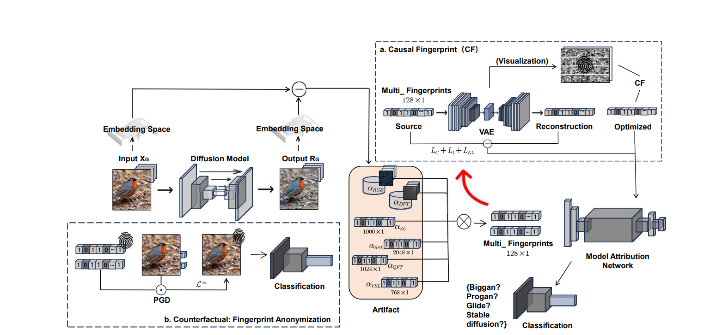
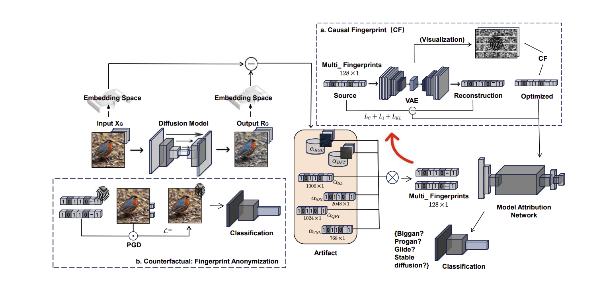

# Deepfake Classification Workflow

## 1. Problem Statement

**Goal:** Discriminate between real images and images generated by autoregressive (AR) generators.

AR generators predict tokens step by step: `p(x1) -> p(x2|x1) -> ...` using negative log-likelihood loss. The next token prediction is based on a distribution `p_theta`, with sampling being stochastic depending on configuration.

### Target Models

| Model | Tokenization | Prediction Strategy |
|-------|--------------|---------------------|
| **HMAR** | Multi-scale VQ | Next-scale prediction |
| **LlamaGen** | Standard 2D VQ-VAE | Raster-order prediction |
| **VAR** | Multi-scale VQ | Next-scale prediction |
| **RAR** | BPE-like tokenizer | Randomized-order masked AR |

---

## 2. How Autoregressive Image Generation Works

```
============================================================
 AUTOREGRESSIVE IMAGE GENERATION
============================================================

  Prompt: "a red cat"
        |
        v
  +-------------------+
  |   Text encoder    |
  +-------------------+
        |
        v
  +-------------------+
  | Text embeddings   |  <-- conditioning context
  +-------------------+    (visible at every step)
        |
        |  always visible below
        v

  Step 1:  [text] ----------------------> img_1
  Step 2:  [text] + img_1 --------------> img_2
  Step 3:  [text] + img_1, img_2 -------> img_3
  Step 4:  [text] + img_1, img_2, img_3 -> img_4
   ...
  Step N:  [text] + img_1 ... img_(N-1) -> img_N

  Each P(img_t | text, img_1, ..., img_(t-1))
  is sampled from the transformer.

        |
        v
  +-------------------------+
  | Grid of N image tokens  |   e.g. 16x16 = 256 ints
  +-------------------------+
        |
        v
  +-------------------------+
  |   VQ-VAE decoder        |   tokens -> pixels
  +-------------------------+
        |
        v
  +-------------------------+
  |   Final RGB image       |   H x W x 3
  +-------------------------+
```

### Key Insight: Text is Context, Not a Seed

```
  WRONG mental model:
        "cat" ---> img_token_42
        "red" ---> img_token_91
        (direct mapping, then continue from there)

  RIGHT mental model:
        +---------------------------+
        |  text embeddings (fixed)  |
        +---------------------------+
              |        |        |
              v        v        v
            img_1 -> img_2 -> img_3 -> ...
                     ^         ^
                     |         |
              also sees all previous image tokens
```

### What an Image Token Actually Is

```
  Original image (256 x 256 x 3 pixels)
        |
        v  VQ-VAE encoder
  16 x 16 grid of vectors
        |
        v  snap each to nearest codebook entry
  16 x 16 grid of integers in [0, 8191]
  = 256 image tokens

  Each integer indexes a learned "visual patch":
  texture, edge, color blob, etc.
  Not a word. Not a pixel. A patch pattern.
```

---

## 3. Theoretical Background

### References

- [Causal Fingerprints - Xu et al. April 2026](https://arxiv.org/pdf/2509.15406)

**Core Idea:** Classify based on *Causal Fingerprints* - features within AI-generated images related to model architecture and algorithmic configuration.



### Differentiating Factors

1. **Tokenizer Family:** AR systems share a common pipeline: (a) tokenize image into discrete codes, (b) train transformer to predict codes autoregressively, (c) sample codes and decode to pixels. The tokenization method determines the visual fingerprint.

2. **Model Capacity:** Transformer size can differentiate between sub-family groups.

3. **Sensor Noise:** Original images may contain camera-specific noise patterns.

---

## 4. Feature Extraction Approach

### Semantic-Invariant Latent Spaces (SILS)

The goal is to transform images to a space where content is suppressed and generator artifacts are emphasized.


**Reconstruction Residual Method:** Compute `X - X̂` where `X̂` is a reconstruction of the original. Because reconstruction is lossy and model-specific, the residual reveals:
- Reconstruction model biases
- Features the reconstructor struggled with (often correlate with generation method)

Xu et al. use a pre-trained Diffusion Reconstruction Residual (DIRE) for this purpose.

### Available Feature Lenses

```
Residual r
                            │
        ┌───────────┬───────┼───────┬───────────┬─────────┐
        ▼           ▼       ▼       ▼           ▼         ▼
       RGB         DCT     QFT    ResNet      ViT       DINO
     (pixels)   (freq)  (low-f)   (SL)       (VSL)      (SSL)
        │           │       │       │           │         │
        └───────────┴───────┴───┬───┴───────────┴─────────┘
                                ▼
                     weighted fusion (TBD)
                                │
                                ▼
                    Causal fingerprint F_G
```

#### Pixel-Level / Signal-Level Views

| Lens | Description | Use Case |
|------|-------------|----------|
| **RGB** | Raw pixel values of residual | Color-channel artifacts, local pixel glitches |
| **DCT** | Discrete Cosine Transform per channel | Frequency energy distribution, periodic textures |
| **QFT** | Low-frequency FFT on grayscale | Broad structural patterns |

#### Learned / Semantic Views

| Lens | Model | Description |
|------|-------|-------------|
| **SL** | ResNet101 (ImageNet) | Local, texture-like patterns |
| **VSL** | Vision Transformer | Global structure via attention |
| **SSL** | DINO ResNet50 | General visual structure (self-supervised) |

#### Summary: All 6 Lenses

| # | Name | Method | What it captures | Status |
|---|------|--------|------------------|--------|
| 1 | **RGB** | Raw pixel values | Color-channel artifacts, local glitches | Implemented |
| 2 | **DCT** | Discrete Cosine Transform per channel | Frequency energy distribution | Implemented |
| 3 | **QFT** | FFT on grayscale, low-freq only | Broad structural patterns | Implemented |
| 4 | **SL** | ResNet101 encoder (ImageNet) | Local texture patterns (supervised) | Not yet |
| 5 | **VSL** | ViT class-token features | Global structure via attention (supervised) | Not yet |
| 6 | **SSL** | DINO ResNet50 encoder | General visual structure (self-supervised) | Not yet |

> **Note:** The paper fuses all 6 lenses with learned weights to create the final causal fingerprint. Currently, only the signal-level lenses (RGB, DCT, QFT) are implemented for Stage 1 classification.



---

## 5. Two-Stage Classification Architecture

### Overview

```
                ┌─────────────┐
                │ Input image │
                └──────┬──────┘
                       │
                       ▼
        ┌──────────────────────────────┐
        │  STAGE 1: Family classifier  │
        │  (spectral / low-level cues) │
        └──────────────┬───────────────┘
                       │
       ┌───────────┬───┴────┬────────────┐
       ▼           ▼        ▼            ▼
     Real      LlamaGen   VAR/HMAR      RAR
                  │         │            │
                  ▼         ▼            ▼
        ┌──────────────────────────────┐
        │  STAGE 2: Within-family      │
        │  (semantic / deep features)  │
        └──────────────┬───────────────┘
                       │
                       ▼
              One of 9 source labels
```

- **Stage 1 (Family Classifier):** Spectral features + simple classifier → predicts {Real, LlamaGen-family, VAR/HMAR-family, RAR-family}
- **Stage 2 (Within-Family Classifier):** Deep semantic features → splits LlamaGen-B vs LlamaGen-L, VAR-d20 vs VAR-d30, etc.

### Detailed Architecture

```

┌─────────────────────────────────────┐
                    │         INPUT IMAGE (.png)          │
                    └──────────────────┬──────────────────┘
                                       │
                                       ▼
                    ┌─────────────────────────────────────┐
                    │     Stage1FeatureExtractor          │
                    │  (same for training & inference)    │
                    │  → feature vector of length N       │
                    └──────────────────┬──────────────────┘
                                       │
                                       ▼
                    ┌─────────────────────────────────────┐
                    │           STAGE 1                   │
                    │   Coarse classifier (4-way)         │
                    │   "Which FAMILY?"                   │
                    │                                     │
                    │   classes_ = [0, 1, 2, 3]           │
                    │   ┌──────┬──────────┬──────────┬──┐ │
                    │   │ Real │ LlamaGen │ VAR_HMAR │RAR│ │
                    │   └──┬───┴────┬─────┴────┬─────┴─┬─┘ │
                    └──────┼────────┼──────────┼───────┼───┘
                           │        │          │       │
              ┌────────────┘        │          │       └────────────┐
              │           ┌─────────┘          └─────────┐          │
              ▼           ▼                              ▼          ▼
         ┌─────────┐ ┌──────────────┐         ┌───────────────┐ ┌──────────┐
         │ family  │ │  STAGE 2     │         │  STAGE 2      │ │ STAGE 2  │
         │   = 0   │ │  head[1]     │         │  head[2]      │ │ head[3]  │
         │         │ │              │         │               │ │          │
         │  no     │ │  LlamaGen    │         │  VAR_HMAR     │ │  RAR     │
         │  head   │ │  (binary)    │         │  (4-way)      │ │ (binary) │
         │ needed  │ │              │         │               │ │          │
         │         │ │ B  vs  L     │         │ d20 / d30 /   │ │ L vs XXL │
         │         │ │              │         │ nspvar_20 /   │ │          │
         │         │ │              │         │ nspvar_30     │ │          │
         └────┬────┘ └──────┬───────┘         └───────┬───────┘ └────┬─────┘
              │             │                         │              │
              ▼             ▼                         ▼              ▼
         ┌────────┐    ┌──────────┐            ┌────────────┐  ┌──────────┐
         │ fine=0 │    │ fine=1   │            │ fine=3     │  │ fine=7   │
         │ "Real" │    │ or fine=2│            │ or 4, 5, 6 │  │ or fine=8│
         └────────┘    └──────────┘            └────────────┘  └──────────┘
              │             │                         │              │
              └─────────────┴─────────────┬───────────┴──────────────┘
                                          ▼
                          ┌─────────────────────────────┐
                          │  FINE PREDICTION (0..8)     │
                          │  one of FINE_NAMES          │
                          └─────────────────────────────┘

```


**Final Output:** One of 9 source labels
`{Real, HMAR-d20, HMAR-d30, LlamaGen-B, LlamaGen-L, VAR-d20, VAR-d30, RAR-L, RAR-XXL}`

---

## 6. Current Implementation (Stage 1)

### Feature Extraction

The fingerprint `F` must be decoupled from image content `C` and style `S`.

**Current approach:** FFT-bin determination on normalized, grayscale images.

**Extracted patterns:**
- Spectral peaks
- Radial spectrum profile
- Residual statistics
- Color statistics

### Implemented Lenses

1. **RGB Lens** - Pixel-domain statistics on high-pass residual
2. **DCT Lens** - 2D Discrete Cosine Transform per channel
3. **QFT Lens** - Grayscale FFT, low-frequency band

### Classifiers

- Logistic Regression
- Linear SVM (with probability calibration)
- Histogram Gradient Boosting

See `src/README.md` for usage instructions.
