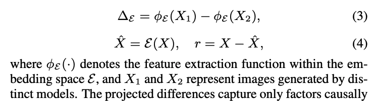

# Start

What am i discriminating? -> autoregressiv generators -> this means  prediciting step by step! p(x1) -> p(x2/x1) -> .... with a loss working over neg. log. likelihood! 
Okay so the next token prediction is based on a distribution p_theta. The sampling happens based on the policy and can be determinstic or stochastic depending on the config. 


Models that I have :
- HMAR -> Multi-scale VQ Tokenization with next-scale prediction
- LlamaGen -> Standard 2D VQ-VAE with raster-order prediction
- VAR -> Multi-scale VQ Tokenization with next-scale prediction
- RAR -> Randomized-order masked AR with a BPE-like tokenizer 


The idea is to classify based on an its causal fingerprint (https://arxiv.org/pdf/2509.15406):

-> *Causal Fingerprints are features within images generated by AIGC
models, related to model architecture and algorithmic configuration*

1.  the tokenzier family The AR systems in this exercise work the same way: (a) tokenize the image into discrete codes, (b) train a transformer to predict those codes autoregressively, (c) at inference time, sample codes and decode them back to pixels -> hence the way the tokenization works determines the visual fingerprint! 

2.  The Capactity -> How big the transformer is


3. Potential sensor noise (the original images)


So I can run 



to goal here is to transform the images to a  semantic-invariant latent space (SILS) via a shared feature extraction function. Xu et al. just take the difference between the two imgages with the idea that only the CF is the difference (as the reconstruction model is putting in its own CF).


Because reconstruction is lossy and model-specific, X − X̂ isn't zero — and what's not zero is informative. It tells you something about either:

The reconstruction model's biases (less interesting here), or
features of the original image that the reconstructor struggled with (more interesting — these often correlate with how the original was generated)

-> Xu et al. use a pre-trained Diffusion Reconstruction Residual (DIRE) for this purpose.

but they offer further semantic invarient latent spaces: 


Residual r
                            │
        ┌───────────┬───────┼───────┬───────────┬─────────┐
        ▼           ▼       ▼       ▼           ▼         ▼
       RGB         DCT     QFT    ResNet      ViT       DINO
     (pixels)   (freq)  (low-f)   (SL)       (VSL)      (SSL)
        │           │       │       │           │         │
        └───────────┴───────┴───┬───┴───────────┴─────────┘
                                ▼
                     weighted fusion
                                │
                                ▼
                    Causal fingerprint F_G

### Pixel-level / signal-level views (3):

1. RGB space — just the raw pixel values of the residual. The most direct view. Good for spotting color-channel artifacts or local pixel-level glitches.

2. DCT (Discrete Cosine Transform) — converts each color channel into a frequency map. This is the same math JPEG uses. It reveals how energy is distributed across frequencies, which is useful because generators often leave characteristic patterns at certain frequencies (e.g., over-smooth high frequencies, or weird periodic textures).

3. QFT (low-frequency FFT on grayscale) — convert to grayscale, apply Fast Fourier Transform, keep only the low-frequency part. This focuses on the broad structural patterns rather than fine detail. Different from DCT in that it's grayscale and emphasizes the low-frequency band specifically.


### Learned / semantic views (3):
These don't look at pixels — they look at how a pre-trained neural network "sees" the image. The intuition: a network trained on millions of images has internalized what natural images look like, so its internal representations can highlight unnatural patterns.

4. SL (Supervised Learning) — ResNet101 trained on ImageNet — feed the image through a CNN classifier, grab the encoder's features. ResNets tend to capture local, texture-like patterns.

5. VSL (Vision Supervised Learning) — Vision Transformer (ViT) — feed the image through a ViT, grab the "class token" feature. ViTs see images more globally (attention across patches), so this captures different structure than the CNN.

6. SSL (Self-Supervised Learning) — DINO ResNet50 — DINO is trained without labels, just by learning to make different views of the same image agree. This produces features that are less biased toward classification-relevant content and more sensitive to general visual structure.


## Hence i am build a two stage classifier

Stage 1 (family classifier): spectral features + simple classifier → predicts {Real, LlamaGen-family, VAR/HMAR-family, RAR-family}. Should be very accurate.

Stage 2 (within-family classifier): deep semantic features → splits LlamaGen-B vs LlamaGen-L, VAR-d20 vs VAR-d30, etc. Harder, but tractable.

### High level classifier: 

```
                ┌─────────────┐
                │ Input image │
                └──────┬──────┘
                       │
                       ▼
        ┌──────────────────────────────┐
        │  STAGE 1: Family classifier  │
        │  (spectral / low-level cues) │
        └──────────────┬───────────────┘
                       │
       ┌───────────┬───┴────┬────────────┐
       ▼           ▼        ▼            ▼
     Real      LlamaGen   VAR/HMAR      RAR
                  │         │            │
                  ▼         ▼            ▼
        ┌──────────────────────────────┐
        │  STAGE 2: Within-family      │
        │  (semantic / deep features)  │
        └──────────────┬───────────────┘
                       │
                       ▼
              One of 9 source labels
```


### Detailed Classifier


```
                          ┌─────────────────────┐
                          │   Input image       │
                          │   (256x256 RGB)     │
                          └──────────┬──────────┘
                                     │
                                     ▼
                  ┌──────────────────────────────────┐
                  │  Feature extraction (spectral)   │
                  │  - 2D FFT magnitude              │
                  │  - Radial / peak features at     │
                  │    1/16, 1/13, 1/10, 1/8 ...     │
                  │  - Noise residual statistics     │
                  └──────────────────┬───────────────┘
                                     │
                                     ▼
              ╔══════════════════════════════════════════╗
              ║  STAGE 1: Family classifier              ║
              ║  (linear / SVM / small MLP, 4-way)       ║
              ╚══════════════════════╤═══════════════════╝
                                     │
        ┌────────────────┬───────────┼───────────────┬────────────────┐
        ▼                ▼           ▼               ▼                ▼
   ┌─────────┐     ┌──────────┐  ┌────────┐     ┌─────────┐    ┌──────────┐
   │  Real   │     │ LlamaGen │  │  VAR / │     │   RAR   │    │ (low     │
   │ImageNet │     │  family  │  │  HMAR  │     │  family │    │ confidence│
   │         │     │          │  │ family │     │         │    │  → fall  │
   │ → DONE  │     │          │  │        │     │         │    │  through)│
   └─────────┘     └─────┬────┘  └────┬───┘     └────┬────┘    └─────┬────┘
                         │            │              │               │
                         ▼            ▼              ▼               ▼
              ╔══════════════════════════════════════════════════════════╗
              ║  STAGE 2: Within-family classifier                       ║
              ║  (ResNet-50 / CLIP features + small head)                ║
              ║  Trained per family OR one shared net w/ family as input ║
              ╚══════════════════════════╤═══════════════════════════════╝
                                         │
        ┌──────────────┬─────────────────┼─────────────┬───────────────┐
        ▼              ▼                 ▼             ▼               ▼
   ┌──────────┐  ┌──────────┐      ┌──────────┐  ┌──────────┐   ┌──────────┐
   │LlamaGen-B│  │LlamaGen-L│      │ VAR-d20  │  │ VAR-d30  │   │  RAR-L   │
   └──────────┘  └──────────┘      │ HMAR-d20 │  │ HMAR-d30 │   │  RAR-XXL │
                                   └──────────┘  └──────────┘   └──────────┘
                                          │             │
                                          │             │     (HMAR vs VAR
                                          ▼             ▼      is the hard
                                    ┌──────────┐  ┌──────────┐  split — needs
                                    │ HMAR-d20 │  │ HMAR-d30 │  finer features
                                    │   vs     │  │   vs     │  or contrastive
                                    │ VAR-d20  │  │ VAR-d30  │  embeddings)
                                    └──────────┘  └──────────┘

Final output: one of 9 source labels
{Real, HMAR-d20, HMAR-d30, LlamaGen-B, LlamaGen-L,
 VAR-d20, VAR-d30, RAR-L, RAR-XXL}
````


# Current State
# STAGE 1  - Feature Extraction Function: 
Fingerprint F must be decoupled from the Image Content $C$ and the style $S$.


1. FFT-Bin determinatin on normalized, gray-scaled images for fast and effective FFT! 


Identifing patterns: 
- Spectral Peaks
- Radial spectrum profile
- Residual Statisttics
- Color Statistics


